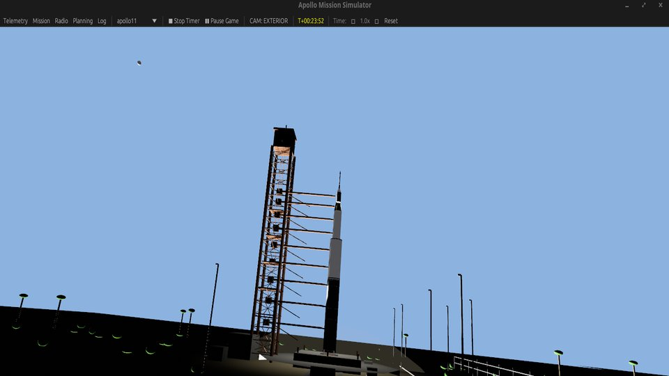

# Apollo Mission Simulator

> **WARNING: Very early, buggy experience awaits.**

A 3D Apollo mission simulator built with Rust and the Bevy game engine. Features
a historically accurate Command Module interior, interactive control panels, a
real yaAGC-powered Apollo Guidance Computer, and realistic orbital mechanics.



## Features

- **Historically Accurate CM Interior**: Conical frustum hull with accurate
  dimensions from NASA Operations Handbook (3.91m base, 3.48m height)
- **Interactive Panels**: Clickable switches, circuit breakers, DSKY keys, FDAI
  display, and event timer — all wired to spacecraft subsystems
- **Real AGC Integration**: Powered by the actual yaAGC emulator running
  Comanche055 (Apollo 11 CM software). The 3D DSKY is a real terminal for the
  AGC — press V37E and the AGC actually receives it
- **Realistic Lunar Orbit**: Elliptical, inclined orbit with accurate Keplerian
  mechanics, initialized to the Apollo 11 launch epoch (1969-07-16 13:32 UTC)
- **80 Fault Scenarios**: From electrical bus failures and cryogenic tank wiring
  faults to AGC program alarms and crew interface edge cases. Each is a
  diagnostic puzzle: Observe → Isolate → Decide → Act → Verify. See
  [docs/faults-reference.md](docs/faults-reference.md) for the full catalog
- **Houston Radio**: Ground control dialogue via authentic MOCR positions
  (CAPCOM, FLIGHT, EECOM, GUIDO, FIDO, SURGEON). Optional LLM-enhanced mode
  for dynamic, context-aware responses based on live spacecraft state
- **Historically Accurate Communications**: Unified S-Band radio with correct
  subcarriers (1.024 MHz data, 1.25 MHz voice), modulation, and telemetry frame
  format verified against CuriousMarc Apollo Comms restoration data

## Missions

- **Apollo 11** — Full lunar landing mission (prelaunch → TLI → landing → reentry)
- **Apollo 13** — Includes the scripted oxygen tank explosion scenario at MET 55:00:00
- **Free Flight** — Open sandbox with no scripted events

## Controls

- **WASD** — Move inside the capsule
- **Q/E/Space/Shift** — Vertical movement
- **RMB Hold** — Look around (interior mode)
- **LMB** — Click switches, breakers, DSKY keys
- **Escape** — Unlock cursor
- **Tab** — Switch camera mode (Interior / Exterior / Free)

## Building

Requires Rust 1.79+ and the yaAGC library built from
[virtualagc](https://github.com/rburkey2005/virtualagc).

```bash
cargo run --release
```

### LLM-Enhanced Houston Radio (Optional)

Build with the `llm-npcs` feature to enable AI-powered ground control dialogue:

```bash
cargo run --release --features llm-npcs
```

Set environment variables to configure the LLM backend:

```bash
export HOUSTON_LLM_API_KEY="your-api-key"       # Required for Enhanced mode
export HOUSTON_LLM_URL="https://api.openai.com"  # Default
export HOUSTON_LLM_MODEL="gpt-4o"                # Default
```

In mission setup, select "Houston Radio: Enhanced" (auto-detected when API key is
present). Without the feature flag, only scripted Classic dialogue is available.

## License

This project is licensed under the GNU General Public License v2.0 or later.
See [LICENSE](LICENSE) and [NOTICE.md](NOTICE.md) for details.

The GPL is required because this project statically links with yaAGC, which is
GPL-licensed. The original Apollo Guidance Computer software (Comanche055,
Luminary099, etc.) is in the public domain as a work of the US Government.

## Attribution

- **yaAGC**: Ronald S. Burkey and the Virtual AGC Project
  (https://www.ibiblio.org/apollo/)
- **Bevy Engine**: Bevy Contributors (https://bevyengine.org/)
- **Historical Data**: NASA Operations Handbook, CuriousMarc Apollo Comms series
